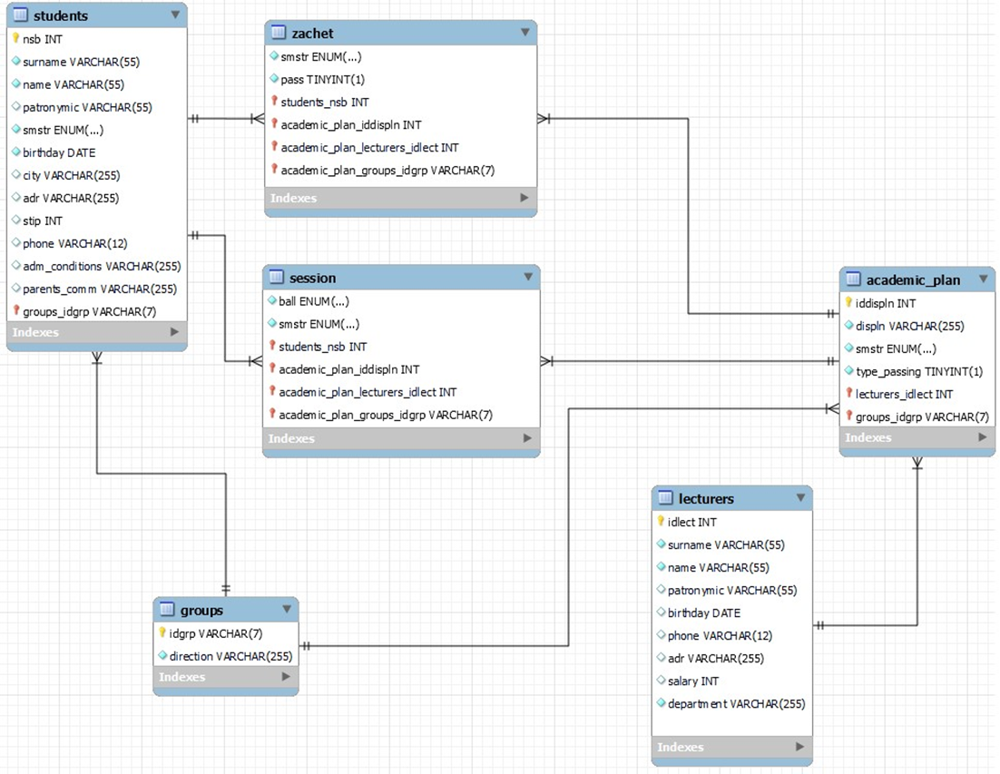

# База данных «Работа деканата»

Целью реализуемого проекта является учет студентов и их успеваемости. А именно:

1.	Ведение базы данных с полной информацией о студентах и поиск по ней.
2.	Распечатка ведомостей на каждый зачет и экзамен по группам с учетом учебного плана.
3.	Поиск задолжников по определенным предметам, кандидатов на отчисление.
4.	Поиск кандидатов на стипендию.
5.	Оформление вкладышей для дипломов.
6.	В конце 4-го курса вычислить претендентов на красный диплом.
7.	Распределить стипендии успевающим студентам с учетом успеваемости и курса.

Базу данных образуют шесть таблиц:
1.	students – таблица студентов
2.	groups – таблица групп
3.	academic_plan – таблица учебного плана
4.	lecturers – таблица преподавателей
5.	session – таблица оценок за экзамены
6.	zachet – таблица зачетов

При запуске и переходе по адресу веб-приложения открывается список студентов. 
Кроме списка студентов и полной информации о них, на странице присутствует формы для поиска нужных студентов по ФИО и группе. 
После нажатия кнопки «Поиск» появится новый список студентов, формируемый по той комбинации, которую ввели в формы. Так же на любой странице веб-приложения есть верхняя панель, на которой присутствуют переходы на все необходимые страницы, где реализован вывод результата соответственных поставленных задач. 
* При нажатии «Студенты»: вы будете отправлены на полный список студентов.
* При нажатии «Ведомости» → «Экзамены»: вы будете отправлены на страницу с ведомостью группы по экзаменам в этом семестре, где присутствует выбор группы с помощью выпадающего списка. 
* При нажатии «Ведомости» → «Зачеты»: вы будете отправлены на страницу с ведомостью группы по зачетам в этом семестре, где присутствует выбор группы с помощью выпадающего списка. 
* При нажатии «Задолженности» → «Задолженности по предметам»: вы будете отправлены на страницу с информацией о студентах кто не сдал предмет с таким названием, где присутствует выбор предмета с помощью выпадающего списка.
* При нажатии «Задолженности» → «Кандидаты на отчисление»: вы будете отправлены на страницу с информацией о студентах-должниках.
* При нажатии «Стипендия» → «Кандидаты на стипендию»: вы будете отправлены на страницу с информацией о тех студентах, кто успешно сдал сессию и претендует на стипендию.
* При нажатии «Стипендия» → «Распределить стипендию»: вы будете отправлены на страницу с полным списком студентов, где будет высчитана стипендия.
* При нажатии «Диплом» → «Вкладыши для дипломов»: вы будете отправлены на страницу с информацией об успеваемости студента по итогу четырех курсов, где выбор студента можно осуществить с помощью выпадающего списка. 
* При нажатии «Диплом» → «Красный диплом»: вы будете отправлены на страницу с информацией о претендентах на красный диплом. Для этого студенту необходимо набрать средний балл по итогу четырех курсов 4,75 и более. 